# PerSearch

## Введение

В данной работе рассматривается реализация метода поиска особых точек – «гистограмм направленных градиентов» - для локализации и оценки интенсивности потока объектов на видеопоследовательности в поглощающих областях. В основе алгоритма лежит HOG дескриптор, описывающий как меняется на изображении яркость и саму структуру этих перепадов, принятие решений реализует линейный классификатор SVM.

## Постановка задачи

Имеется видеопоток с камеры, захватывающей изображение в виде фиксированного прямоугольника P, в котором имеются объекты. Искомым объектом считается человек в полный рост. Необходимо провести отслеживание траектории движения искомых объектов и идентифицировать их, подсчитать количество людей, находящихся на кадре видеопоследовательности и прошедших в заданной подобласти прямоугольника (см. рисунок). По заданному интервалу ∆t необходимо определить дискретные моменты времени t1, t2,….tR, где ti=ti-1+∆t, получить вектор n1,n2,…nR, где ni – количество объектов, входящих в подобласть прямоугольника за промежуток времени [ti-1,ti].
Детектирование объектов на исходных изображениях заключается в детектировании положения всех объектов искомого класса на изображении. Положение объекта возможно определить либо, как множество пикселей (на рис. множество А), соответствующих объекту, либо, как координаты прямоугольника (на рис. - M), окаймляющего искомый объект. В представленной работе рассмотрен второй подход – выходным результатом алгоритма детектирования представляется множество окаймляющих прямоугольников. Для этого используются HOG-признаки.

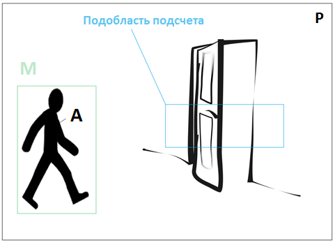

Положение объекта – это множество пикселей А на изображение, в котором находится объект. Прямоугольник М  A является окаймляющим прямоугольником, заданный параметрами:
    1. (rec.x, rec.y) – координаты верхнего левого угла прямоугольника
    2. rec.width – ширина окаймляющего прямоугольника
    3. rec.height – высота окаймляющего прямоугольника

## Решение

Алгоритм работы программы пошагово (см. приложение E):  
1. Покадровое чтение (рисунок 4.20).

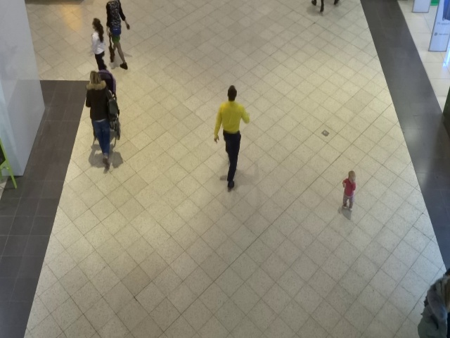  
Рисунок 4.20. – Считаный кадр с видеопоследовательности.
2. Вычисление сцены и обновление переднего фона [22] представлено на рисунках 4.21 – 4.24.

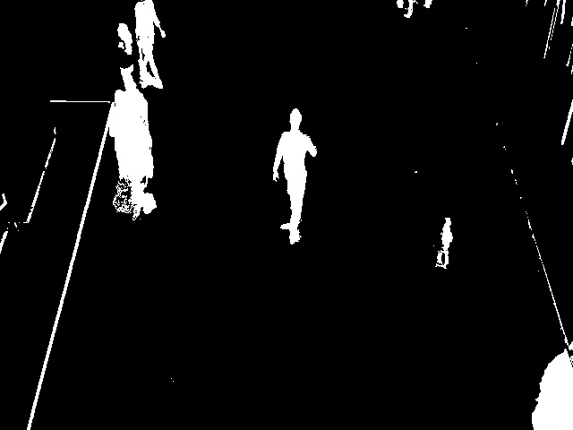  
Рис. 4.21 – Результат расчета маски переднего плана

  
Рис. 4.22. – Результат применения фильтра размытия по Гауссу

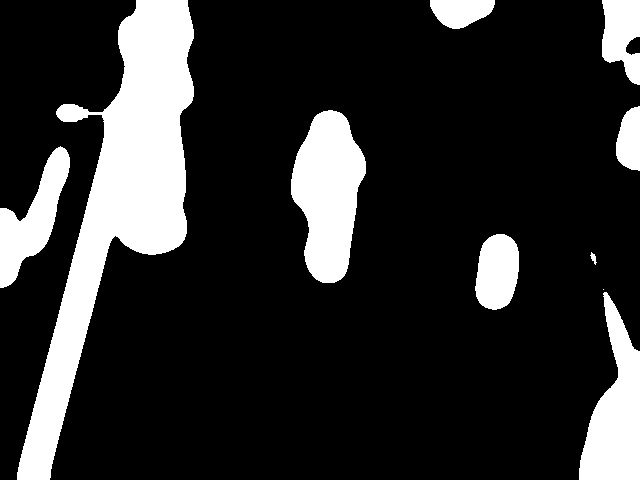  
Рис. 4.23. – Результат применения порогового преобразования

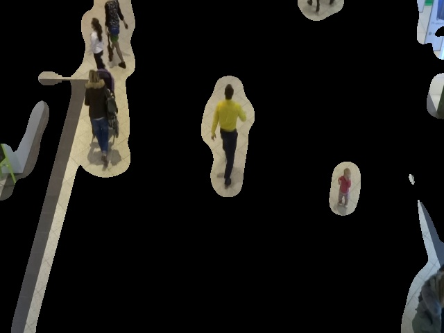  
Рис. 4.24. – Результирующее изображения обновленного переднего фона

3. Вычисление градиента пикселей изображения
Для каждой ячейки рассчитываются приближенные значения градиента. Результатом вычисления являются две матрицы производных вдоль осей x и y – Dx (рисунок 4.25) и Dy (рисунок 4.26) соответственно.
На основе этих матриц вычисляются матрицы направлений (direction) (рисунок 4.27) и силы градиента (magnitude) (рисунок 4.28).

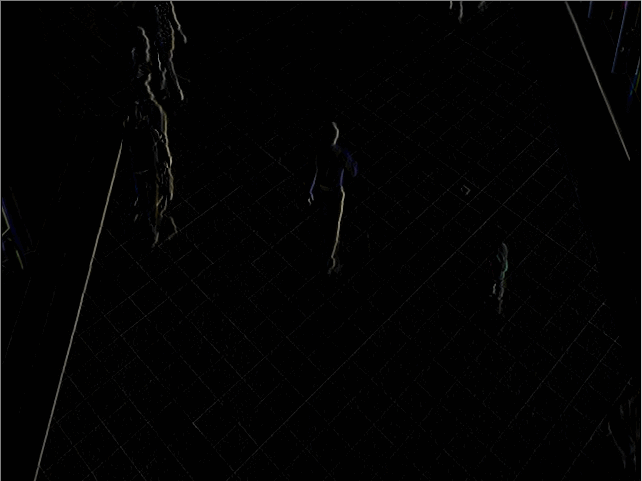  
Рис. 4.25 - Приближенное значение градиента вдоль оси X

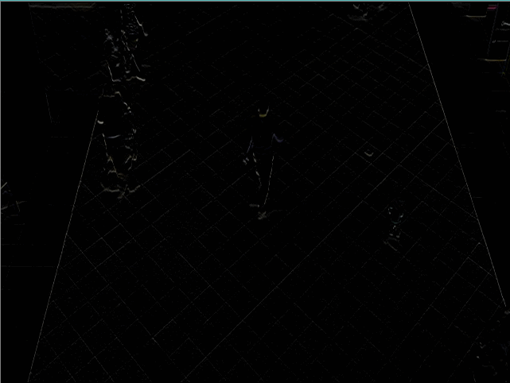  
Рис. 4.26. - Приближенное значение градиента вдоль оси Y

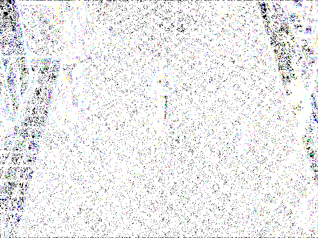  
Рис. 4.27. - Полученная матрица направлений градиента

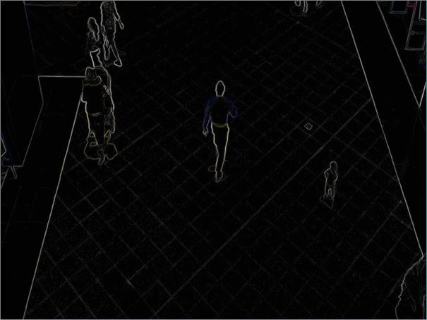  
Рис. 4.28. - Полученная матрица силы градиента

4. Вычисление гистограмм ячеек
Матрицы направлений (direction) и силы градиента (magnitude) используются для вычисления гистограмм, как показано на рисунке 4.29.

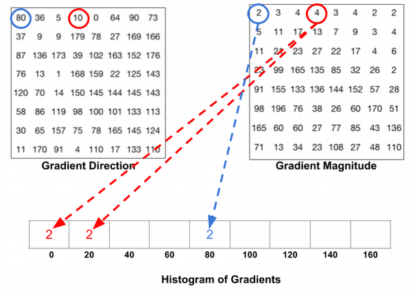  
Рисунок 4.29. Расчет гистограммы ячеек
5. Группирование ячеек в более крупные связные блоки, представлено на рисунках 4.30 и 4.31.
Для устойчивости к изменениям контрастности и яркости градиенты необходимо локально нормировать, для этого ячейки группируются в более крупные связные блоки. Ячейка, как правило, включается в более чем один конечный дескриптор потому, что блоки перекрывают друг друга.

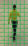  
Рисунок 4.30. Ячейки размером 8х8

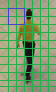  
Рисунок 4.31. Группирование ячеек в блоки 16х16

6. Нормализация блоков
Навнит Далал и Билл Триггс исследовали методы нормализации блоков, которые значительно улучшают результаты по сравнению с ненормализованными. Комбинация этих гистограмм и является дескриптором. Далее полученный дескриптор отправляется классификатору, для принятия решения.
7. Классификация полученных дескрипторов при помощи линейного классификатора (SVM) (рисунок 4.32).

  
Рисунок 4.32. Результат решения классификатора.
8. Принятие решения о отслеживании и восстановлении найденных объектов (рисунок 4.33).

  
Рисунок 4.33. Результат разработанного класса для слежения за объектами.
9. Отображение результатов
В процессе обработки отображаются промежуточные результаты (рисунок 4.34) и ползунки возможных настроек детектора.

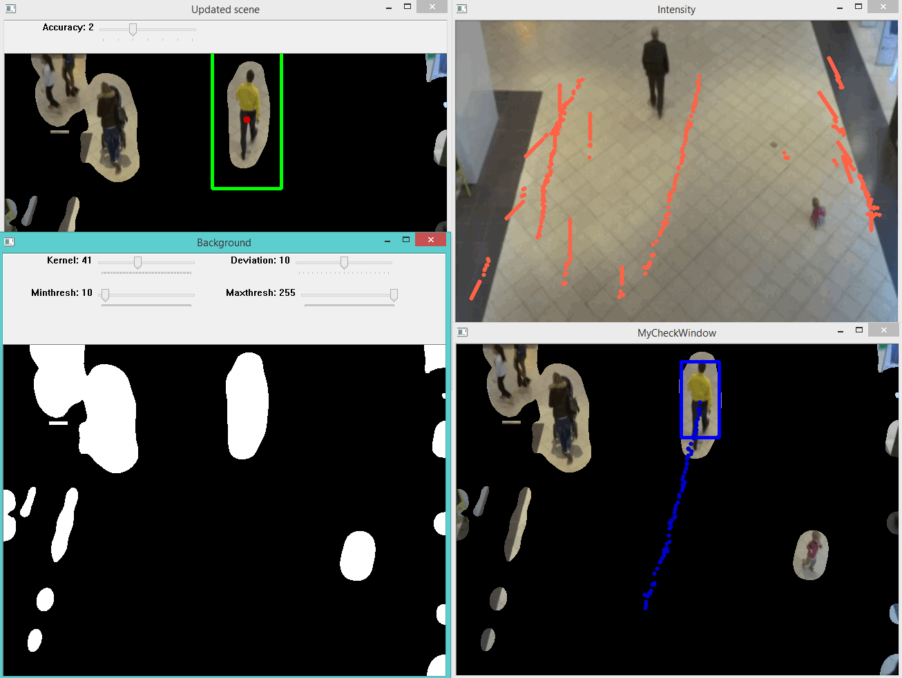  
Рисунок 4.34. – Отображение результатов во время обработки видеофайла

10. Анализ полученных положений найденных объектов относительно интересующих нас областей (ROI) и вычисление интенсивности потока.
Получив данные с детектора и обработав их, зная отрезок времени и итоговое время работы детектора мы можем рассчитать график интенсивности потока пешеходов, прошедших через регионы.

## Результаты
Результаты сохраняются в папку [Files/DetectResults](PerSearch/Files/DetectResults).
## Подробнее
За более подробным описанием :
- [Презентация с защиты диссертации](.Презентация.pptx)
- [Диссертация](.М091501_70_ВКРМ_Толмачев.docx)
